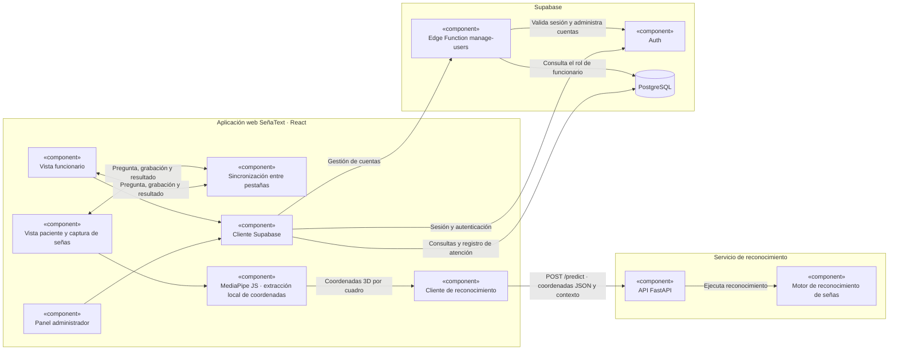

# Componentes de SeñaText

Diagrama de la arquitectura definida en arc42. MediaPipe JS extrae coordenadas en el navegador y el contrato de reconocimiento utiliza JSON.

```mermaid
flowchart LR
    subgraph WEB["Aplicación web SeñaText · React"]
        VP["«component»<br/>Vista paciente y captura de señas"]
        VF["«component»<br/>Vista funcionario"]
        VA["«component»<br/>Panel administrador"]
        SYNC["«component»<br/>Sincronización entre pestañas"]
        MP["«component»<br/>MediaPipe JS · extracción local de coordenadas"]
        HTTP["«component»<br/>Cliente de reconocimiento"]
        SB["«component»<br/>Cliente Supabase"]

        VP <-->|Pregunta, grabación y resultado| SYNC
        VF <-->|Pregunta, grabación y resultado| SYNC
        VP --> MP
        MP -->|Coordenadas 3D por cuadro| HTTP
        VF --> SB
        VA --> SB
    end

    subgraph REC["Servicio de reconocimiento"]
        API["«component»<br/>API FastAPI"]
        MOTOR["«component»<br/>Motor de reconocimiento de señas"]
        API -->|Ejecuta reconocimiento| MOTOR
    end

    subgraph DATA["Supabase"]
        AUTH["«component»<br/>Auth"]
        PG[("PostgreSQL")]
        EDGE["«component»<br/>Edge Function manage-users"]
        EDGE -->|Valida sesión y administra cuentas| AUTH
        EDGE -->|Consulta el rol de funcionario| PG
    end

    HTTP -->|POST /predict · coordenadas JSON y contexto| API
    SB -->|Sesión y autenticación| AUTH
    SB -->|Consultas y registro de atención| PG
    SB -->|Gestión de cuentas| EDGE
```
