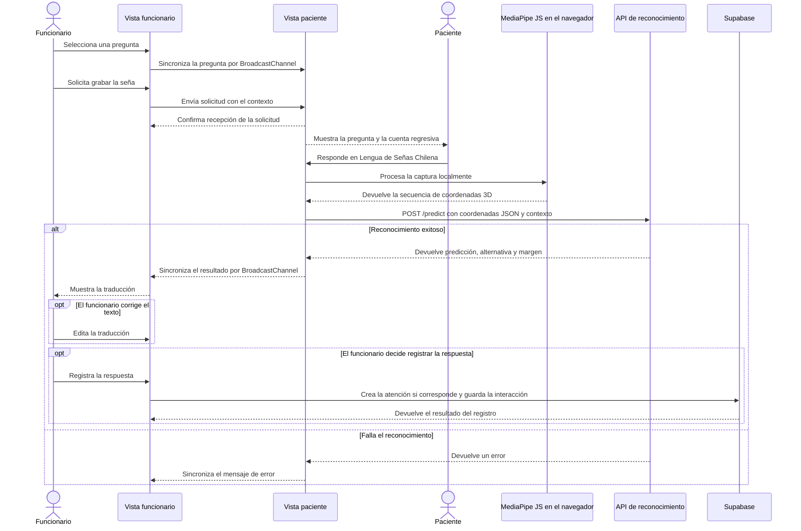

# Secuencia del reconocimiento de una seña

Flujo principal de atención según la arquitectura definida en arc42. Las vistas se sincronizan entre pestañas del mismo navegador.

```mermaid
sequenceDiagram
    actor F as Funcionario
    participant VF as Vista funcionario
    participant VP as Vista paciente
    actor P as Paciente
    participant MP as MediaPipe JS en el navegador
    participant API as API de reconocimiento
    participant DB as Supabase

    F->>VF: Selecciona una pregunta
    VF->>VP: Sincroniza la pregunta por BroadcastChannel
    F->>VF: Solicita grabar la seña
    VF->>VP: Envía solicitud con el contexto
    VP-->>VF: Confirma recepción de la solicitud
    VP-->>P: Muestra la pregunta y la cuenta regresiva
    P->>VP: Responde en Lengua de Señas Chilena
    VP->>MP: Procesa la captura localmente
    MP-->>VP: Devuelve la secuencia de coordenadas 3D
    VP->>API: POST /predict con coordenadas JSON y contexto

    alt Reconocimiento exitoso
        API-->>VP: Devuelve predicción, alternativa y margen
        VP-->>VF: Sincroniza el resultado por BroadcastChannel
        VF-->>F: Muestra la traducción
        opt El funcionario corrige el texto
            F->>VF: Edita la traducción
        end
        opt El funcionario decide registrar la respuesta
            F->>VF: Registra la respuesta
            VF->>DB: Crea la atención si corresponde y guarda la interacción
            DB-->>VF: Devuelve el resultado del registro
        end
    else Falla el reconocimiento
        API-->>VP: Devuelve un error
        VP-->>VF: Sincroniza el mensaje de error
    end
```
